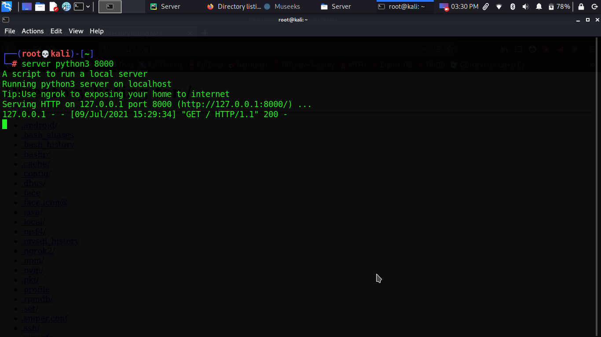

**What's New**

- [x] Added Custom [Golang](https://golang.org) server

# All one line server script
**This bash script can save a lot of time for you**
 
**Just execute it on your system and run a local server**

## Install
**Clone the repo**

**And mv server to your env path so you can access it from anywhere**

**Change the permission to executable**

```bash
git clone https://github.com/W1LDN16H7/Server.git
cd Server && sudo mv server /usr/local/bin
sudo chmod +x /usr/local/bin/server
```  


**Now you are ready to fire**

## Usage
 **For Listing The Servers run** 
  

  ```
  sudo server list
  ```
<p align="center">
	
</p>

**For running a server run**

  ```
  sudo server <server> <port>
  ```

**without these <> sign**

## Examples

* **Starting a python server**

```
server python3 8000
```
**This will start a server on** [localhost](https://127.0.0.1:8000)

<p align="center">
	
</p>

<br>

<p align="center">
	
</p>


* **Starting a php server**

```
server php 8000
```
**And a server will start  on** [localhost](https://127.0.0.1:8000)

* **Starting a golang server**

<br>
<p align="center">
	
</p>


**And so on**

## Add more 
**Add more one line server in the list or suggest me a will come with updated version**

## License
**This free to use and modify all you have to pay is to give a** [star](https://github.com/W1LDN16H7/Server) **to the repo**

**And star the project also you can** [Follow](https://github.com/W1LDN16H7/) **me**
